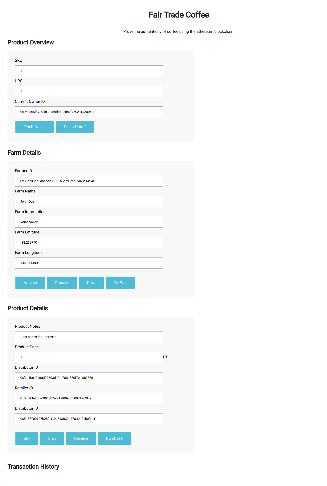
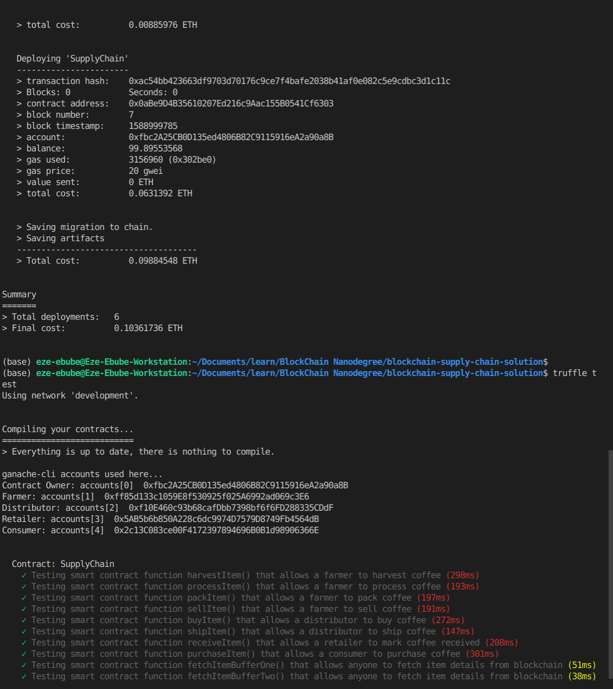
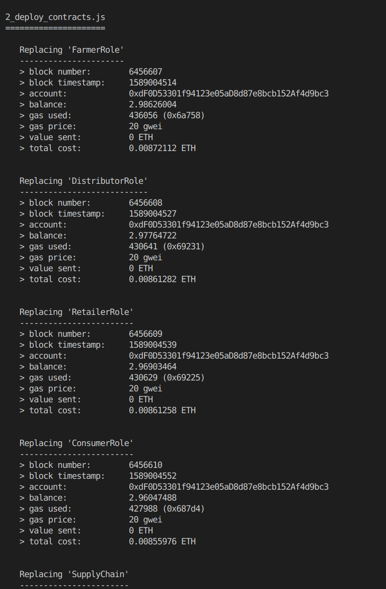

# Blockchain Supply Chain Solution

This repository contains an Ethereum DApp that demonstrates a Supply Chain flow from a farmer to a consumer. The user story is similar to any commonly used supply chain process. A farmer produces and sells items which are bought, received and sold by the distributor. The retailer buys from the distributor and sells to teh consumer.

## Project Writeup

#### Diagrams: Contained in the Diagram Folder

### Contract Details
Rinkeby Address: https://rinkeby.etherscan.io/address/0xdF0D53301f94123e05aD8d87e8bcb152Af4d9bc3

ContractID: https://rinkeby.etherscan.io/address/0x9f828c38e4f3d0344113f49e1adba572735bd6b3

Transaction Hash: 0x0e2d1469782489c5ccb8cb49a57615770f6c4658344c298a3a109960116a7640

### Built With:

* [Ethereum](https://www.ethereum.org/) - Ethereum is a decentralized platform that runs smart contracts
* [Truffle Framework](http://truffleframework.com/) - Truffle is the most popular development framework for Ethereum with a mission to make your life a whole lot easier.

* [Solidity](https://solidity.readthedocs.io/en/v0.4.24/) - Solidity is an object-oriented, high-level language for implementing smart contracts.

* [web3.js](https://web3js.readthedocs.io/en/v1.2.1/) - web3.js is a collection of libraries which allow you to interact with a local or remote ethereum node, using a HTTP or IPC connection.


### Versions
Compiler: Solidity - 0.4.24 (solc-js)

ganache-cli: 6.9.1

Truffle v5.1.24 (core: 5.1.24)

Node v12.16.3

Web3.js v1.2.1

## Getting Started

These instructions will get you a copy of the project up and running on your local machine for development and testing purposes. 

### Prerequisites

Please make sure you've already installed ganache-cli, Truffle and enabled MetaMask extension in your browser.


### Installing

A step by step series of examples that tell you have to get a development env running

Clone this repository:

```
git clone https://github.com/Ezeebube5/blockchain-supply-chain-solution.git
```

Install all requisite npm packages (as listed in ```package.json```):

```
npm install
```

### Using the App

Launch Ganache:

```
ganache-cli -m "spirit supply whale amount human item harsh scare congress discover talent hamster"
```

In a separate terminal window, Compile smart contracts:

```
truffle compile
```

This will create the smart contract artifacts in folder ```build\contracts```.

Migrate smart contracts to the locally running blockchain, ganache-cli:

```
truffle migrate
```


Test smart contracts:

```
truffle test
```

All 10 tests should pass.


In a separate terminal window, launch the DApp:

```
npm run dev
```

### Interacting with the frontend

In the Product Overview section, the consumer can verify authenticity of the item by calling Fetch Data 1 with the upc as input, this will return essential consumer information.

Additional information can be retrieved by calling Fetch Data 2 this will return information essential to the supplychain.

In the farm details section, the farmer can harvest, process, pack and put up items for sale. Inputs include - Farmer ID, Farm name, farm information, Farm Latitude and Farm Longitude

A Buyer can purchase such items from the inventory system. Additionally a Seller can mark an item as Shipped, and similarly a Buyer can mark an item as Received.

### Screenshots
####  Dapp

#### Terminal

#### Deployment


## Acknowledgments
* Udacity: Provided starter code and lesson examples.
* Solidity
* Ganache-cli
* Truffle

